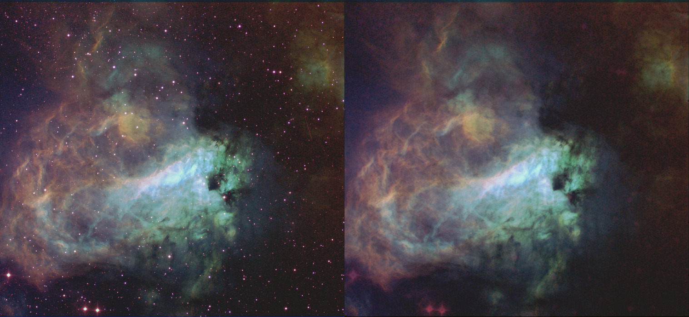
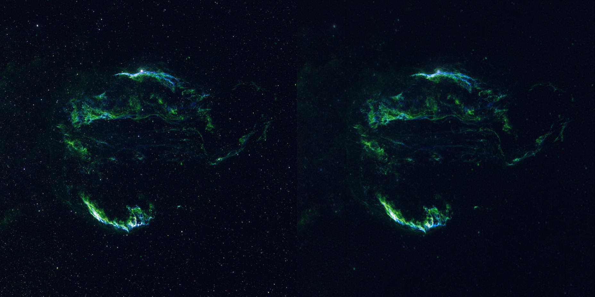

# Star reduction in deep sky images

Starrem2k13 is a simple tool for removing stars from astronomical images. Starrem2k13 uses a GAN trained on augmented data. It's code was inspired from a [sample at Tensorflow's website](https://www.tensorflow.org/tutorials/generative/pix2pix). The training data consists of only three base images.

Below are examples of what it can do:






# Installing
Currently binaries for Windows, Linux and MacOS are available in the releases section. These were created using PyInstaller. Using pre-complied binary is the recommended way of running Starrem2k13. Once you have downloaded and installed the program you can run it simply by typing the following in command prompt/terminal

```shell
starrem2k13 image_with_stars.jpg  image_without_stars.jpg
```

## Running using Docker (if binaries don't work)

```
docker run   -v $PWD:/usr/src/app/starrem2k13/data  \
-it code2k13/starrem2k13 \
/bin/bash -c "./starrem2k13.py ./data/example.jpg  ./data/example_starless.jpg"
```
Note that *$PWD* refers to your current working directory. In the above example it is assumed that the file *example.jpg* resides in your current working directory. This directory is mounted as a volume with the path */usr/src/app/starrem2k13/data* inside the docker container. The output image *example_starless.jpg* will also be written to same directory.


## Running with local python installation (for geeks)
Clone the repository and navigate to the 'starrem2k13' folder. Install required packages :

```shell
git clone https://github.com/code2k13/starrem2k13.git
cd starrem2k13
pip install -r requirements.txt
```

Additionally you may also have to install lfs support for git
```shell
sudo apt-get install git-lfs
git lfs pull
```
> 📍If you run into bandwidth issues with git-lfs, you can simply download weights [from here]( https://github.com/code2k13/starrem2k13/releases/download/v1.0_weights/weights.zip) and unzip to root directory (a folder with weights will
> get created beside starrem2k13 executable. This folder contains weights required by the program).

Run inference on image. 
```shell
python starrem2k13.py image_with_stars.jpg  image_without_stars.jpg
```

> Supprots greyscale and RGB images. Alpha channel (if any) in the source image is removed during processing. Gives issues on some types of TIFF files.


## Trying out the model in a web browser
Here is link to a online demo of star reduction created using a trained model, TFJS and ReactJS. Please use a **desktop browser** to access the demo (for memory and performance reasons). The demo runs locally inside your browser, no data outside of your computer. Here is the link to the demo : https://ashishware.com/static/star_removal/index.html


## Training model on your images

The [notebook](train/star-removal-from-astronomical-images-with-pix2pix.ipynb) is available in the train folder.

You can also view/run it on Kaggle:
[https://www.kaggle.com/finalepoch/star-removal-from-astronomical-images-with-pix2pix](https://www.kaggle.com/finalepoch/star-removal-from-astronomical-images-with-pix2pix)


## Attribution

The training images used in this code were sourced from Wikimedia Commons and processed using GIMP.


### Star cluster NGC 3572 and its surroundings
This image was downloaded from Wikimedia Commons and star mask was created by me using GIMP

Link to the processed image: [training_data/star_map_base.png](training_data/star_map_base.png)

> [ESO/G. Beccari, CC BY 4.0](https://creativecommons.org/licenses/by/4.0), via Wikimedia Commons

Url: [https://commons.wikimedia.org/wiki/File:The_star_cluster_NGC_3572_and_its_dramatic_surroundings.jpg](https://commons.wikimedia.org/wiki/File:The_star_cluster_NGC_3572_and_its_dramatic_surroundings.jpg) 

Direct Link: [https://upload.wikimedia.org/wikipedia/commons/9/95/The_star_cluster_NGC_3572_and_its_dramatic_surroundings.jpg](https://upload.wikimedia.org/wikipedia/commons/9/95/The_star_cluster_NGC_3572_and_its_dramatic_surroundings.jpg)


